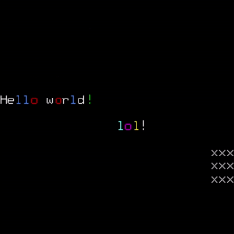
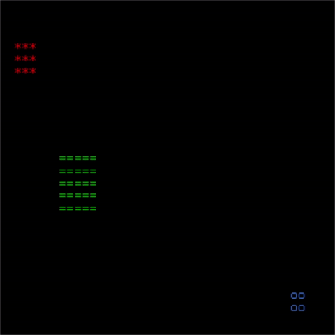
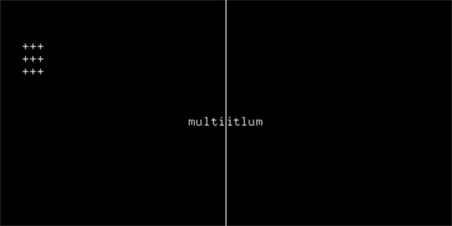

# glasskey
`glasskey` is a library for displaying ASCII animations using OpenGL which I developed
to help visualize some of the solutions for [Advent of Code](http://adventofcode.com).
The idea is to make it very easy to write programs that show their results as ASCII
art, which can additionally be combined with the built-in video capture functionality
in Windows 10 (using `Win` + `G`) and other app capture methods to create videos.

## Getting Started

I provide two interfaces at time of writing, one for C++ and a Python binding for the
C++. Check in [Releases](https://github.com/matajoh/glasskey/releases) for the latest
packages and wheels. Here is a [sample program](samples/cpp/hello_world.cpp) in C++:

```c++
#include "glasskey/glasskey.h"

int main(int argc, char *argv[])
{
    const gk::Size ROWS = 2*gk::COL_WIDTH;
    const gk::Size COLS = 2*gk::ROW_HEIGHT;
    const gk::Size BALL_SIZE = 3;

    // create a TextGrid
    auto text_grid = gk::create_grid(ROWS, COLS, "Hello World");

    // map certain ASCII characters to a color
    text_grid->map_color('o', gk::Colors::Red);
    text_grid->map_color('l', gk::Colors::Blue);
    text_grid->map_color('!', gk::Colors::Green);

    // start the GL main loop
    gk::start();

    // some loop variables
    gk::Rect bounds(COLS-BALL_SIZE, ROWS, BALL_SIZE, BALL_SIZE);
    gk::Index row = 0;
    std::string text = "Hello World!";

    // let's look at an animation loop
    for(int i=0; i<100; ++i){
        // first we clear the grid
        text_grid->clear(row, 0, static_cast<gk::Index>(text.size()));
        text_grid->clear(bounds);

        // animate        
        bounds = bounds.translate(0, -1);
        if(bounds.bottom() == 0){
            bounds = bounds.translate(0, ROWS+BALL_SIZE);
        }
        row = (row + 1) % ROWS;

        // we can draw text directly to the grid
        text_grid->draw(row, 0, text);
        // we can draw rectangles of the same character
        text_grid->draw(bounds, 'x');

        // both of the above methods use the grid's default
        // color mapping. We can control the coloring directly
        // as shown below.
        std::vector<gk::Letter> letters = {
            {'l', gk::Colors::Cyan},
            {'o', gk::Colors::Magenta},
            {'l', gk::Colors::Yellow},
            {'!', gk::Colors::White}
        };
        text_grid->draw(ROWS/2, COLS/2, letters);

        // finally we signal that we are done drawing.
        // You can optionally pass a target framerate
        // (default is 30hz)
        gk::next_frame(10);
    }

    // stop the GL main loop
    gk::stop();
}
```

For reference, here is the same program in Python:

```python
import glasskey as gk

ROWS = 2*gk.ColumnWidth
COLS = 2*gk.RowHeight
BALL_SIZE = 3

def _main():
    # create a TextGrid
    text_grid = gk.create_grid(ROWS, COLS, "Hello World")

    # map certain ASCII characters to a color
    text_grid.map_color('o', gk.Colors.Red)
    text_grid.map_color('l', gk.Colors.Blue)
    text_grid.map_color('!', gk.Colors.Green)

    # start the GL main loop
    gk.start()

    # the animation loop
    bounds = gk.Rect(COLS-BALL_SIZE, ROWS, BALL_SIZE, BALL_SIZE)
    row = 0
    text = "Hello world!"
    for i in range(1, 100):
        # clear the grid
        text_grid.clear(row, 0, len(text))
        text_grid.clear(bounds)

        # animate
        bounds = bounds.translate(0, -1)
        if bounds.bottom == 0:
            bounds = bounds.translate(0, ROWS+BALL_SIZE)
        
        row = (row + 1) % ROWS

        # we can draw text directly to the grid
        text_grid.draw(row, 0, text)

        # we can draw rectangles of the same character
        text_grid.draw(bounds, 'x')
    
        # both of the above methods use the grid's default
        # color mapping. We can control the coloring directly
        # as shown below
        letters = [
            gk.Letter('l', gk.Colors.Cyan),
            gk.Letter('o', gk.Colors.Magenta),
            gk.Letter('l', gk.Colors.Yellow),
            gk.Letter('!', gk.Colors.White)
        ]
        text_grid.draw(ROWS//2, COLS//2, letters)

        # finally we signal that we are done drawing.
        # You can optionally pass a target framerate
        # (default is 30hz)
        gk.next_frame(10)

    # stop the GL main loop
    gk.stop()


if __name__ == "__main__":
    _main()

```

## Samples

We provide three samples to demonstrate the functionality of the library:

### Hello World

The Hello World sample demonstrates the basic functionality of the library
(as seen above) and is provided in:

- [C++](samples/cpp/hello_world.cpp)
- [Python](samples/python/hello_world.py)
- [Julia](samples/julia/hello_world.jl)



### Bouncing Balls

The bouncing balls sample shows some simple animations and coloring, showing
how to use the library in combination with your own classes. It is provided in:
- [C++](samples/cpp/bouncing_balls.cpp)
- [Python](samples/python/bouncing_balls.py)
- [Julia](samples/julia/bouncing_balls.jl)



### Multi-Window

The multi-window sample shows how the library is able to handle having multiple
windows open at the same time and interacting with each other. It is provided in:
- [C++](samples/cpp/multi_window.cpp)
- [Python](samples/python/multi_window.py)
- [Julia](samples/julia/multi_window.jl)



## Build Instructions

It is recommended that you use the pre-built binaries I provide if possible. Otherwise,
To build the project, you will first need to obtain the following
dependencies:
- [CMake](https://cmake.org/)
- [FreeGLUT](http://freeglut.sourceforge.net/)
- [Pybind11](https://github.com/pybind/pybind11) *Optional: needed to build the Python module*

You will need to ensure that FreeGLUT and Pybind11 are installed and discoverable
by CMake. Once that is done, you can initialize and build the project in the following fashion:

```
mkdir build
cmake ..
cmake --build . --config Debug
cmake --build . --config Release
```

This will build the C++ library. You can then install it using:

```
cmake --build . --config Debug --target INSTALL
cmake --build . --config Release --target INSTALL
```

This will install both debug and release versions of the library.

### Python

If you wish to install the Python yourself or build your own wheels, you can
use the standard Python setuptools approach:

```
python setup.py develop
```

will build the module and install it on your local machine.

```
python setup.py bdist_wheel
```

will build a binary wheel that you can use for installation.


## Frequently Asked Questions

### Why does my animation go so fast?

Did you remember to call `gk::next_frame()`? This is the most common cause
of animations going too quickly.

### Why doesn't my animation ever update?

Remember to call `gk::blit()` or the library will not know to redraw
the TextGrid.

## Support

If you have questions, suggestions, or feature requests please raise
an issue. Hope you find this library useful!!
